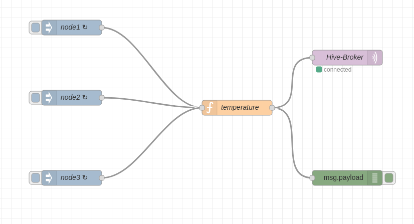

## Automatic node red flow deployer

This code automatically deploys the node red flow inside a docker container. It does not expose any service or port outside the dockerized environment. 


### Use-case as an IoT sensor:

A typical use-case of such deployment environment is using a node-red flow as a bunch of secured sensor behind a NAT, where the commminucation between the sensors is inside DMZ and completely isolated from external environment. This scenario simulates an Industrial IoT infrastructure.

This work achieves this using isolation of sensor nodes using `docker` and `docker-compose`. The sensors are in complete isolation at every state of operation. 

### Usage

##### Build
It can be easily build using docker-compose. 

```bash
$ docker-compose up -d --no-deps --build
```
It creates both the node-red and deployement container.

##### Flow Deployment

This can be used in two ways
a) Automatic
b) Manual deployment

Automatic mode deploys all the flows (`*.json` files) present in the `deploy_flow/flows` directory.
It is automatically deployed when we trigger the docker-compose containers using:

```bash
$ docker-compose up
```

Manual flow deployed all the flows present inside the `deploy_flow/flows` directory and can be triggered by starting only `custom-flow` service.

```bash
$ docker-compose up custom-flow
```
#### Example 

The example temp.json creates a flow that has three sensors and publish temerature to an MQTT broker at a specific intervals. 

See fig below:



---
This code uses Eficode's [wait-for.sh](https://github.com/eficode/wait-for) to gracefully check if the node-red container is running.